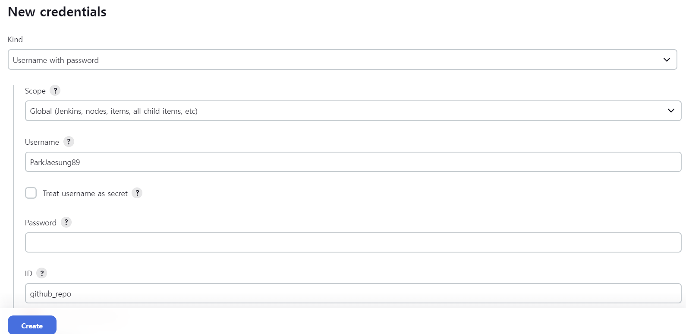
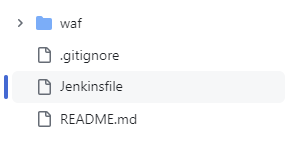
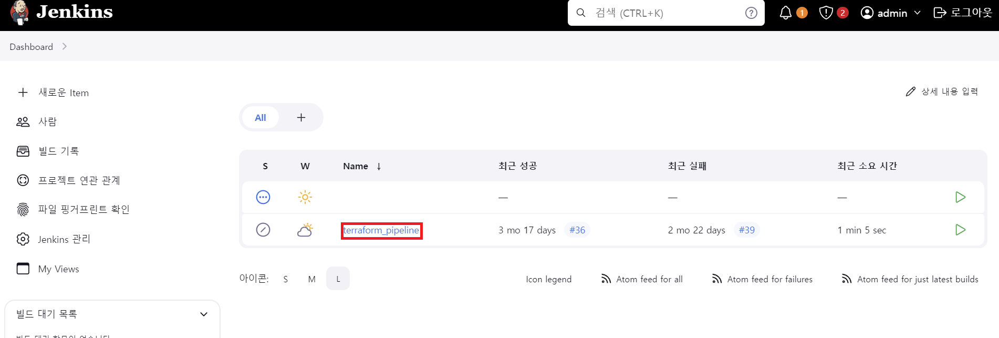
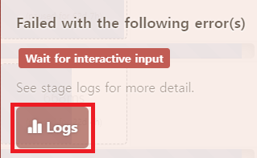
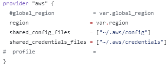

# Jenkis활용한 Terraform pipeline 구성

## docker 설치

### docker의 apt repo 셋업

```bash
# 충돌 방지를 위한 기존 도커엔진 삭제
for pkg in docker.io docker-doc docker-compose docker-compose-v2 podman-docker containerd runc; do sudo apt-get remove $pkg; done

# Add Docker's official GPG key:
sudo apt-get update
sudo apt-get install ca-certificates curl
sudo install -m 0755 -d /etc/apt/keyrings
sudo curl -fsSL https://download.docker.com/linux/ubuntu/gpg -o /etc/apt/keyrings/docker.asc
sudo chmod a+r /etc/apt/keyrings/docker.asc

# Add the repository to Apt sources:
echo \
  "deb [arch=$(dpkg --print-architecture) signed-by=/etc/apt/keyrings/docker.asc] https://download.docker.com/linux/ubuntu \
  $(. /etc/os-release && echo "$VERSION_CODENAME") stable" | \
  sudo tee /etc/apt/sources.list.d/docker.list > /dev/null
sudo apt-get update
```

### docker 패키지 설치

```bash
# 최신버전 설치
sudo apt-get install docker-ce docker-ce-cli containerd.io docker-buildx-plugin docker-compose-plugin


## 특정버전 설치
## List the available versions:
#apt-cache madison docker-ce | awk '{ print $3 }'
#
#5:26.1.0-1~ubuntu.24.04~noble
#5:26.0.2-1~ubuntu.24.04~noble
#...
#
#VERSION_STRING=5:26.1.0-1~ubuntu.24.04~noble
#sudo apt-get install docker-ce=$VERSION_STRING docker-ce-cli=$VERSION_STRING containerd.io docker-buildx-plugin docker-compose-plugin


# docker test
sudo docker run hello-world

# Install docker compose(yaml 파일로 관리위해)
sudo apt install docker-compose
```

## Jenkins 설치

docker-compose.yml 파일 생성

```bash
$ vi docker-compose.yml
$ mkdir /home/jenkins_home
# yml 파일에 jenkins 작성
version: "3"
services:
  jenkins:
    image: jenkins/jenkins:lts
    user: root
    volumes:
      - ./jenkins:/home/jenkins_home
    ports:
      - 8080:8080

$ sudo docker-compose up -d     ## yml 파일위치에서 데몬으로 실행명령
```

## jenkins 로그인

jenkins log에 생성 후 password 정보가 주어지며 해당 pawssword 값으로 로그인 가능.

```bash
$ sudo docker logs jenkins

*************************************************************
*************************************************************
*************************************************************

Jenkins initial setup is required. An admin user has been created and a password generated.

Please use the following password to proceed to installation:


XXXXXXXXXXXXXXXXXXXXXXXXXXXXXXXX


This may also be found at: /var/jenkins_home/secrets/initialAdminPassword

*************************************************************
*************************************************************
*************************************************************
```

## Terraform pipeline 구성 작업

1. Jenkins 관리 > Plugins 에서 "terraform" 을 검색 후 install
   
   

2. github에서 인증을 위한 token 생성

   > Github 오른쪽 프로필 선택 > Settings > Developer settings > Personal access tokens > tokens (classic)  
   > 편의를 위해서 no expiration date로 되있지만 이건 회사 정책에 맞게 날짜를 지정해 주면 됩니다.
   > 

3. Github 인증을 위한 Credentials 생성

   > Dashboard -> Jenkins 관리 -> Credentials -> System -> Global credentials -> Add Credentials
   >   
   > 

4. Pipeline 생성
   > new item > pipeline 선택

- General 설정에서 "Github project"를 체크하고 Project url을 작성

  > 

  - Github project 선택 후 Project url에 github repo url 작성
    

- Pipeline 연동을 위한 설정 값 작성

  > Github를 webhook 통하여 변경된 부분을 체크하여 Jenkinsfile에 미리 작성된 액션을 수행하도록 하기위하여 아래와 같이 작성한다.
  > 

  - Definition는 github의 repo에 Jenkinsfile을 추가하여 스크립팅 하기위하여 'Pipeline script from SCM'을 선택
  - SCM은 Git을 선택
  - Repositories에 github repo url과 인증을 위해서 아까 만들어 둔 github repo Credentials를 선택
  - Branch Specifier에는 github repo의 Branch를 선택(필자는 master)
  - Script Path는 'Jenkinsfile'이라는 이름의 파일에 작성 예정이라 Jenkinsfile의 경로를 작성

5. github 웹훅 설정

- github에서 jenkins와의 웹훅 연동
- 이 설정이 없으면 jenkins에서 생성한 pipeline이 동작하지 않는다.
  >   
  > 

6. Github repo에 'Jenkinsfile' 작성  
   

_Telegram에 연동하여 작업 메시지를 확인하는 것에 대해서는 추후에 추가할 예정입니다._

```bash
#Jenkinsfile
pipeline {
    agent any

    parameters {
        string(name: 'environment', defaultValue: 'terraform', description: 'Workspace/environment file to use for deployment')
        booleanParam(name: 'autoApprove', defaultValue: false, description: 'Automatically run apply after generating plan?')
    }

     environment {
        AWS_ACCESS_KEY_ID     = credentials('AWS_ACCESS_KEY_ID')            #jenkins에 credentials 등록
        AWS_SECRET_ACCESS_KEY = credentials('AWS_SECRET_ACCESS_KEY')        #jenkins에 credentials 등록
        REGION = credentials('AWS_REGION')                                  #jenkins에 credentials 등록

        // Telegram configre
        //TOKEN = credentials('telegram-api')                               #jenkins에 credentials 등록
        //CHAT_ID = credentials('telegram-chatid')                          #jenkins에 credentials 등록

        // Telegram Message Pre Build
        CURRENT_BUILD_NUMBER = "${currentBuild.number}"
        GIT_MESSAGE = sh(returnStdout: true, script: "git log -n 1 --format=%s ${GIT_COMMIT}").trim()
        GIT_AUTHOR = sh(returnStdout: true, script: "git log -n 1 --format=%ae ${GIT_COMMIT}").trim()
        GIT_COMMIT_SHORT = sh(returnStdout: true, script: "git rev-parse --short ${GIT_COMMIT}").trim()
        GIT_INFO = "Branch(Version): ${GIT_BRANCH}\nLast Message: ${GIT_MESSAGE}\nAuthor: ${GIT_AUTHOR}\nCommit: ${GIT_COMMIT_SHORT}"
        TEXT_BREAK = "--------------------------------------------------------------"
        TEXT_PRE_BUILD = "${TEXT_BREAK}\n${GIT_INFO}\n${JOB_NAME} is Building"

        // Telegram Message Success and Failure
        TEXT_SUCCESS_BUILD = "${JOB_NAME} is Success"
        TEXT_WAITING_BUILD = "Waiting for ${JOB_NAME}"
        TEXT_FAILURE_BUILD = "${JOB_NAME} is Failure"
    }

    stages {

        stage('Pre-Build') {
            steps {
		  script{
                        withCredentials([string(credentialsId: 'telegram-api', variable: 'TOKEN'), string(credentialsId: 'telegram-chatid', variable: 'CHAT_ID')]) {
                                        sh "curl --location --request POST 'https://api.telegram.org/bot${TOKEN}/sendMessage' --form 'text=${TEXT_PRE_BUILD}' --form 'chat_id=${CHAT_ID}'"
                                        //sh ' curl -s -X POST https://api.telegram.org/bot"$TOKEN"/sendMessage -d chat_id="$CHAT_ID" -d text="$TEXT_PRE_BUILD" '
                        }
                  }
            }
        }
        stage('Plan') {

            steps {
                sh 'terraform init -upgrade'
                sh "terraform validate"
                sh "terraform plan"
            }
        }
        stage('Approval') {
           when {
               not {
                   equals expected: true, actual: params.autoApprove
               }
           }

           steps {
               script {
                    input message: "Do you want to apply the plan?",
                    parameters: [text(name: 'Plan', description: 'Please review the plan')]

               }
           }
       }

        stage('Apply') {
            steps {
                sh "terraform apply --auto-approve"
            }
            post {
                 always {
                        script{
                              withCredentials([string(credentialsId: 'telegram-api', variable: 'TOKEN'), string(credentialsId: 'telegram-chatid', variable: 'CHAT_ID')]) {
                                       sh "curl --location --request POST 'https://api.telegram.org/bot${TOKEN}/sendMessage' --form 'text=${TEXT_PRE_BUILD}' --form 'chat_id=${CHAT_ID}'"
                                       //sh ' curl -s -X POST https://api.telegram.org/bot"$TOKEN"/sendMessage -d chat_id="$CHAT_ID" -d text="$TEXT_PRE_BUILD" '
                              }
                        }
                 }
            }
        }
    }
}
```

7. github repo에 push하여 build 확인

   > git push 후 jenkins Dashboard에서 생성했던 pipeline 선택  
   > 

   - pipeline 동작시 바로 적용되지 않고 리뷰를 받고 proceed를 눌렀을 경우 실제로 build 진행
     > 

   > _pipeline이 동작했으나 error가 발생할 경우 에러를 클릭하면 내용을 확인 할 수 있다._  
   > 

   - 해당 에러는 terraform provider file에 profile값이 존재해서 발생하는 에러로 jenkins credentials에 profile에 대한 값을 이미 등록해 두었기 때문에 중복으로 충돌에러가 난 것으로 provider file에서 profile 값 주석처리하여 충돌을 방지함.
     > .png>)  
     > 

8. 배포 완료  
   
   - Jenkins의 Log를 확인하면 terraform의 apply후 출력되는 메시지와 동일하게 출력되는 것을 확인 할 수 있다.  
     .png>)
