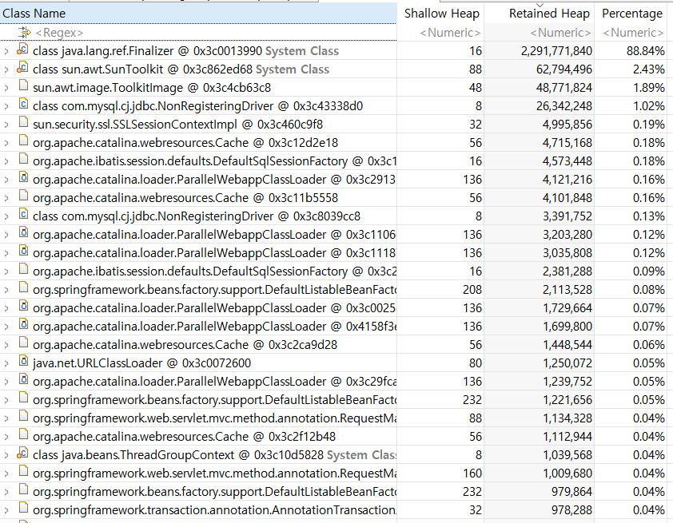

어느날 tomcat 서비스가 비정상적으로 종료된 것을 확인하였습니다.  
zabbix 모니터링을 통해서 웹 시나리오에 등록된 url 알럿 발생 시간을 확인 후 tomcat log를 분석하였습니다.  
해당 시간에 발생한 로그에는 아래와 같았습니다.

```bash
java.lang.OutOfMemoryError: unable to create new native thread
.
.
.
```

처음에 OutOfMemoryError 를 확인 후 OS의 전체 메모리가 부족한 현상이 아닌가 싶어 zabbix에서 해당 시간 메모리 사용량을 확인해보았습니다.


분명 해당시간대에 메모리가 감소한 것을 알 수 있으나 메모리가 0에 가깝게 사용하지는 않고 있는 것을 확인할 수 있습니다.

## Tomcat server의 메모리 사용에 대해서 분석을 해봅시다!

```bash
$ free -mh
              total        used        free      shared  buff/cache   available
Mem:           125G         35G        665M         11M         89G         89G
Swap:           63G        1.0G         63G
```

현재 서버의 평소 메모리 사용량입니다.  
total 125G의 메모리 중에 35G 사용하고 있습니다. 또한 buff/cache는 89G로 잡혀 있으며, buff/cache에 잡히지 않은 사용가능한 메모리는 free로 665M 여유가 있습니다.  
그리고 중요한 값인 available 이 89G 입니다. 이 값은 전체 메모리에서 필요시 사용가능한 메모리 가용량을 뜻합니다.  
free 와 같이 아예 사용중이지 않은 값이 아니라 사용중이더라도 바로 회수해서 사용가능한 영역까지 전부 계산한 값으로 커널에서 아래와 같이 계산한다고 합니다.

```bash
MemAvailable = free + (cached - min(cached / 2, low_wmark_pages)) + (reclaimable - unreclaimable_slabs)
```

위의 요소들을 한번 확인해보면,

- free = free 메모리 값
- cached = 페이지 케시 메모리
- low_wmark_pages = 시스템에서 최소한으로 유지해야되는 페이지 수
- reclaimable = 회수 가능한 슬랩 메모리
- unreclaimable_slabs = 회수 불가능한 슬랩 메모리
  ```bash
  *_slab 이란?_
  _커널 데이터 객체의 생성/파괴의 오버헤드를 줄이기 위해 자주 사용되는 오브젝트들을 미리 만들어서 관리하는 역할을 한다._
  ```

위 계산으로 단순하게 free, share, buff/cache의 값을가지고 판단할 수는 없지만 Available 값이 필요시 할당 받을 수 있는 메모리라는 것은 알 수 있다.  
앞서 본 내용을 바탕으로 현재 OS 영역에서의 메모리 부족이 아니라는 것을 알 수 있습니다.

다시 log 메시지로 돌아와서,  
실제 OutOfMemoryError 이후에 오는 문구인 "unable to create new native thread"를 확인해봐야 됩니다.  
이는 java에서 thread를 생성할 때 생성할 수 없다는 메시지입니다.  
java에서 thread를 생성할 시 필요한 영역이 존재합니다. 그건 바로 Heap 메모리 입니다.  
heap 영역은 JVM(Java Virtual Machine)이 런타임 동안 생성하는 객체와 배열을 저장하는 메모리 영역을 뜻합니다.

위 내용만 봐도 어떤 문제일지 어느정도 감이 잡히지요?  
바로, Heap 영역이 부족하여 발생한 에러인 것이라고 유추할 수 있습니다.  
그럼 java 전체의 메모리 영역에 대해서 어떻게 구성되있는지 구조파악과 분석하기 위한 툴을 사용해 봅시다.

# Java의 메모리 구조 이해하기

## JVM

우선 JVM이 무엇인지 부터 알아야됩니다.
JVM이란 Java Virtual Machine로 자바의 가상머신입니다. java의 바이트 코드를 해석하고 실행하는 역할을 수행합니다.
Java 프로그램은 JVM이란 가상머신안에서 동작하기 때문에 운영체제 상관없이 JAVA를 동작 시킬 수 있다.

## java의 다이어그램

자바 프로그램이 동작하는 과정을 다이어그램으로 살펴보겠습니다.


1. 개발자가 자바 소스를 작성하여 저장하면 우선 '.java' 라는 파일로 저장합니다.
2. 그리고 javac 라는 컴파일러를 통해서 '.class' 확장자를 갖는 바이트코드 파일로 변환합니다.
   (_**java의 바이트코드란** jvm에서 이해할 수 있는 언어로 변환된 자바 소스 코드를 의미한다._)
3. 그 후, 컴파일이 완료된 java프로그램을 실행시키면 JVM은 운영체제로부터 프로그램 실행을 위한 메모리를 항당 받습니다.(그 중에 개발자가 작성한 프로그램이 실제로 동작하는 메모리 영역을 Java Runtime Data 라고 부름)
4. JVM 안의 Class Loader가 .class 파일에서 바이트코드를 읽어서 메모리에 올린다.
5. Execution Engine은 기본적으로 인터프리터 방식으로 바이트 코드를 실행한다.(바이트 코드를 한줄씩 기계어로 번역하여 프로그램을 실행.)
   - 인터프리터 : 바이트코드를 기계어로 번역하는 역할을 한다.
   - JIT : 인터프리터가 읽어온 바이트코드를 캐싱해두고 적절한 시점에 기계어로 번역한다.(인터프리터만을 통해 번역하면 성능이 떨어지기 때문에 캐싱하여 번역을 도운다.)
   - GC(Garbage Collector) : java에서 메모리 관리를 자동으로 해주는 중요한 요소중 하나로 더이상 사용되지 않는 메모리 영역을 탐지하여 비워주는 역할을 한다.
6. 마지막으로, JNI(Java Native Interface)는 자바 프로그램 동작시 다른 언어로 작성된 라이브러리가 존재할 수 있으며 그런 라이브러리를 자바 환경에서 동작하도록 지원하는 역할을 한다.

## java Runtime Data

드디어 java 메모리 영역에 대한 내용입니다.
java의 메모리 영역은 5가지로 나뉩니다.


1. Method : JVM이 시작될 때 생성되며, Class 구조와 Static 필드에 대한 정보만 가지고 있음.
2. Heap : 프로그램이 실행되면서 동적으로 생성되는 데이터들(new연산자로 생성되는 클래스와 인스턴스 변수, 배열 타입 등 Reference Type)을 저장하는 공간으로 모든 쓰레드들이 공유하는 공간
   - heap의 참조 주소는 stack 영역에서 가지고 있으며, 해당 객체를 통해서만 heap 영역에 있는 인스턴스를 핸들링 가능.
   - GC의 대상으로 자동으로 heap 영역에 참조하는 변수나 필드가 없다면 사용하지 않는 것으로 취급하여 메모리를 정리함.
3. Stack : int, long, boolean 등의 기본 자료형을 생성할 때 저장하는 공간으로 임시적으로 사용되는 변수나 정보들을 저장하는 영역, 쓰래드가 생성될 때 생성됨.
   

4. PC register : 쓰래드가 시작될 때 생성되며, 현재 수행중인 jvm의 명령어 주소를 저장하는 공간.
5. Native Method stack : 바이트코드가 아닌 기계어로 작성된 프로그램을 실행시키는 영역이며, 자바 이외의 언어로 작성된 네이티브 코드를 실행하기 위한 공간.

# java 메모리 분석하기

## java-jdk의 기본 툴들 활용

java-jdk를 설치할 경우 기본적으로 설치되는 3가지 툴이 존재한다.
"jps, jmap, jhat"

### jps 란?

우리가 리눅스 상에서 기본적으로 프로세스들을 확인하기 위해서 사용하는 명령어가 있다. 바로, "ps" 라는 명령어이다.
java에서도 JVM의 프로세스들을 확인 할 수 있는 명령어가 바로 "jps" 이다

```bash
$ jps
31265 Jps
10498 Bootstrap

# jps -v 옵션을 추가할 경우 jvm 파라미터들도 같이 출력된다.
# 10498 Bootstrap -Djava.util.logging.config.file=/usr/local/tomcat/conf/logging.properties -Djava.util.logging.manager=org.apache.juli.ClassLoaderLogManager -Djdk.tls.ephemeralDHKeySize=2048 -Djava.protocol.handler.pkgs=org.apache.catalina.webresources -Dorg.apache.catalina.security.SecurityListener.UMASK=0027 -Dignore.endorsed.dirs= -Dcatalina.base=/usr/local/tomcat -Dcatalina.home=/usr/local/tomcat -Djava.io.tmpdir=/usr/local/tomcat/temp
# 31450 Jps -Denv.class.path=.:/usr/local/java/lib/tools.jar:/usr/local/tomcat/lib/jsp-api.jar:/usr/local/tomcat/lib/servlet-api.jar:/usr/local/tomcat/lib/mysql-connector-java-5.1.46-bin.jar -Dapplication.home=/usr/local/java -Xms8m
```

### jmap 이란?

jvm의 맵을 보여주는 기본 분석 툴이다. 자바의 힙 메모리 등의 정보를 얻을 수 있으며, 메모리 dump를 떠서 분석이 가능하다.

1. heap memory 정보 확인

```bash
$ jmap -heap 10498

Attaching to process ID 10498, please wait...
Debugger attached successfully.
Server compiler detected.
JVM version is 25.181-b13

using thread-local object allocation.
Parallel GC with 38 thread(s)

Heap Configuration:
   MinHeapFreeRatio         = 0
   MaxHeapFreeRatio         = 100
   MaxHeapSize              = 8357150720 (7970.0MB)
   NewSize                  = 174587904 (166.5MB)
   MaxNewSize               = 2785542144 (2656.5MB)
   OldSize                  = 349700096 (333.5MB)
   NewRatio                 = 2
   SurvivorRatio            = 8
   MetaspaceSize            = 21807104 (20.796875MB)
   CompressedClassSpaceSize = 1073741824 (1024.0MB)
   MaxMetaspaceSize         = 17592186044415 MB
   G1HeapRegionSize         = 0 (0.0MB)

Heap Usage:
PS Young Generation
Eden Space:
   capacity = 993001472 (947.0MB)
   used     = 325079288 (310.01976776123047MB)
   free     = 667922184 (636.9802322387695MB)
   32.73703989030945% used
From Space:
   capacity = 5242880 (5.0MB)
   used     = 1147064 (1.0939254760742188MB)
   free     = 4095816 (3.9060745239257812MB)
   21.878509521484375% used
To Space:
   capacity = 5242880 (5.0MB)
   used     = 0 (0.0MB)
   free     = 5242880 (5.0MB)
   0.0% used
PS Old Generation
   capacity = 1728053248 (1648.0MB)
   used     = 1146590360 (1093.473777770996MB)
   free     = 581462888 (554.5262222290039MB)
   66.35156418513326% used

53060 interned Strings occupying 6398256 bytes.
```

2. jvm 프로세스의 메모리 통계 확인

```bash
$ jmap -histo {java PID}
 num     #instances         #bytes  class name
----------------------------------------------
   1:       7669039     4261351584  [B
   2:      12519935     2376395008  [C
   3:        473386      537382592  [I
   4:       6169731      148073544  java.lang.String
   5:       1096747       64130408  [Ljava.lang.Object;
   6:        603728       40668944  [Ljava.lang.String;
   7:       1249155       29979720  java.lang.StringBuilder
.
.
.
```

3. jmap dump
   jmap 명령으로 현재 상태의 정보를 덤프로 확인가능합니다.

```bash
# Check Java process
$jps

# Create dump
$jmap -dump:format=b,file={dumpfile_name}.hprof {java_PID}
```


### jhat 이란?

jmap 명령으로 만들어진 힘 메모리 dump파일은 분석툴이 필요합니다. 그중 기본적으로 제공하는 툴이 jhat입니다.
jhat 실행 시 7000포트로 서비스 오픈되며, url을 통해서 해당 포트로 접근하여 dump 내용을 확인할 수 있다.
dump 파일의 크기에 따라서 서비스 오픈에 시간이 걸릴 수 있기 때문에 기다리면 된다.

```bash
# jhat 명령어
$ jhat heapdump1.hprof
Reading from out.hprof...
Dump file created Wed Jul 24 13:44:49 KST 2024
Snapshot read, resolving...
Resolving 4876 objects...
Chasing references, expect 0 dots
Eliminating duplicate references
Snapshot resolved.
Started HTTP server on port 7000
Server is ready.
```

### Eclips MAT(MemoryAnalyzer)

MAT은 메모리 누수를 찾고 메모리 소비를 줄이는데 도움이 되는 java heap 분석기 입니다.
이 도구와 위에서 jmap을 통한 heap dump를 활용하여 메모리 분석이 가능합니다.

1. 설치  
   Download : [Eclipse MAT](https://eclipse.dev/mat/)
   

2. heap dump 열기
   Eclipse MAT 실행 후 heap dump open
   

3. Leak suspects Report를 선택하고 finish
   

## Eclipse MAT을 사용하는 방법을 알아보자


MAT에서 가장 유용한 기능은 3가지 라고 볼 수 있을 것 같습니다.
dominator tree, Histogram, leak suspects report 입니다.

1. "Leak Suspects Report"

- 가장 큰 용량을 차지하고 있는 객체들을 좀 더 세분화 된 파이 도표로 보여줍니다.
- 빈번하게 발생하는 이슈의 경우에 메모리 누수의 원인을 파악하기 쉽습니다.
- 하지만, 빈번하지 않은 경우 아래 'Histogram'과 'Dominator tree'를 확인해야 정확한 원인을 알 수 있습니다.
  

2. "Dominator tree"

- 하나의 클래스가 메모리 누수의 원인으로 의심이 될 경우 분석하기 용이합니다.
- Class 별 메모리 점유율과 함계 하위 클래스를 확인 할 수 있습니다.
- 메모리 점유가 높은 것부터 낮은 것까지 순차적으로 추적할 수 있습니다.
- Shallow Heap 대비 Retained Heap 값이 높은 Class가 메모리 누수의 원인일 가능성이 높습니다.  
  참고 용어)
  - Shallow Heap: 해당 오브젝트가 단독으로 차지하는 메모리
  - Retained Heap: 해당 오브젝트와 연결된 모든 객체를 포함한 메모리 점유량



특정 객체가 지워지지 않을 경우 어떻게 해야 제거가 되는지 확인해보는 것이 중요합니다. GC는 더이상 사용하지 않는 객체를 지웁니다. 그렇다면, 특정 객체를 사용하고 있는 다른 객체가 존재한다는 뜻으로 그럴 경우 확인할 수 있는 방법은 아래와 같습니다.

- 특정 객체 우클릭 -> List objects -> with incomming references
- incoming이란 해당 객체를 참조하고 있는 객체를 보여주는 것이며, 반대로 outgoing이란 해당 객체가 참조하고 있는 객체 입니다.


기존의 dominator mat에서는 보이지 않던 특정 객체의 참조하고 있는 객체를 확인할 수 있습니다.게다가 이 객체를 클릭하면 좌측에 해당 클래스의 멤버 변수값이 노출이 되어 분석하는데 용이합니다.

3. Histogram

- Histogram은 여러 클래스가 메모리 누수의 원인일 경우 유용하게 사용할 수 있습니다.
- 객체별 object의 갯수와 shallow heap, retained heap에 대한 정보를 보여줍니다.


