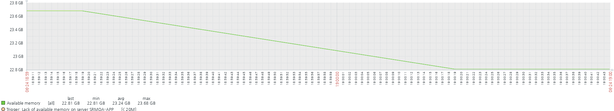

어느날 tomcat 서비스가 비정상적으로 종료된 것을 확인하였습니다.

zabbix 모니터링을 통해서 웹 시나리오에 등록된 url 알럿 발생 시간을 확인 후 tomcat log를 분석하였습니다.

해당 시간에 발생한 로그에는 아래와 같았습니다.

```bash
java.lang.OutOfMemoryError: unable to create new native thread
...
```

처음에 OutOfMemoryError 를 확인 후 OS의 전체 메모리가 부족한 현상이 아닌가 싶어 zabbix에서 해당 시간 메모리 사용량을 확인해보았습니다.



분명 해당시간대에 메모리가 감소한 것을 알 수 있으나 메모리가 0에 가깝게 사용하지는 않고 있는 것을 확인할 수 있습니다.

여기서 OS 영역에서의 메모리 부족이 아니라는 것을 알 수 있으며, 실제 OutOfMemoryError 이후에 오는 문구인 "unable to create new native thread"를 확인해봐야 됩니다.

이는 java에서 thread를 생성할 때 생성할 수 없다는 메시지입니다.
java에서 thread를 생성할 시 필요한 영역이 존재합니다. 그건 바로 Heap 이라고 합니다.
heap 영역은 JVM(Java Virtual Machine)이 런타임 동안 생성하는 객체와 배열을 저장하는 메모리 영역을 뜻합니다.

위 내용만 봐도 어느정도 어떤 문제일지 감이 잡히지요? 바로 Heap 영역이 부족하여 발생한 에러인 것이라고 판단할 수 있습니다.

# 그럼 바로 heap 영역이 어떻게 구성되있는지 확인하고 분석을 해봅시다.

# [분석]

## java-jdk의 기본 툴들 활용

java-jdk를 설치할 경우 기본적으로 설치되는 3가지 툴이 존재한다.
"jps, jmap, jhat"

### jps 란?

우리가 리눅스 상에서 기본적으로 프로세스들을 확인하기 위해서 사용하는 명령어가 있다. 바로, "ps" 라는 명령어이다.
java에서도 JVM의 프로세스들을 확인 할 수 있는 명령어가 바로 "jps" 이다

```bash
$ jps
31265 Jps
10498 Bootstrap

# jps -v 옵션을 추가할 경우 jvm 파라미터들도 같이 출력된다.
# 10498 Bootstrap -Djava.util.logging.config.file=/usr/local/tomcat/conf/logging.properties -Djava.util.logging.manager=org.apache.juli.ClassLoaderLogManager -Djdk.tls.ephemeralDHKeySize=2048 -Djava.protocol.handler.pkgs=org.apache.catalina.webresources -Dorg.apache.catalina.security.SecurityListener.UMASK=0027 -Dignore.endorsed.dirs= -Dcatalina.base=/usr/local/tomcat -Dcatalina.home=/usr/local/tomcat -Djava.io.tmpdir=/usr/local/tomcat/temp
# 31450 Jps -Denv.class.path=.:/usr/local/java/lib/tools.jar:/usr/local/tomcat/lib/jsp-api.jar:/usr/local/tomcat/lib/servlet-api.jar:/usr/local/tomcat/lib/mysql-connector-java-5.1.46-bin.jar -Dapplication.home=/usr/local/java -Xms8m
```

### jmap 이란?

jvm의 맵을 보여주는 기본 분석 툴이다. 자바의 힙 메모리 등의 정보를 얻을 수 있으며, 메모리 dump를 떠서 분석이 가능하다.

1. heap memory 정보 확인
```bash
$ jmap -heap 10498

Attaching to process ID 10498, please wait...
Debugger attached successfully.
Server compiler detected.
JVM version is 25.181-b13

using thread-local object allocation.
Parallel GC with 38 thread(s)

Heap Configuration:
   MinHeapFreeRatio         = 0
   MaxHeapFreeRatio         = 100
   MaxHeapSize              = 8357150720 (7970.0MB)
   NewSize                  = 174587904 (166.5MB)
   MaxNewSize               = 2785542144 (2656.5MB)
   OldSize                  = 349700096 (333.5MB)
   NewRatio                 = 2
   SurvivorRatio            = 8
   MetaspaceSize            = 21807104 (20.796875MB)
   CompressedClassSpaceSize = 1073741824 (1024.0MB)
   MaxMetaspaceSize         = 17592186044415 MB
   G1HeapRegionSize         = 0 (0.0MB)

Heap Usage:
PS Young Generation
Eden Space:
   capacity = 993001472 (947.0MB)
   used     = 325079288 (310.01976776123047MB)
   free     = 667922184 (636.9802322387695MB)
   32.73703989030945% used
From Space:
   capacity = 5242880 (5.0MB)
   used     = 1147064 (1.0939254760742188MB)
   free     = 4095816 (3.9060745239257812MB)
   21.878509521484375% used
To Space:
   capacity = 5242880 (5.0MB)
   used     = 0 (0.0MB)
   free     = 5242880 (5.0MB)
   0.0% used
PS Old Generation
   capacity = 1728053248 (1648.0MB)
   used     = 1146590360 (1093.473777770996MB)
   free     = 581462888 (554.5262222290039MB)
   66.35156418513326% used

53060 interned Strings occupying 6398256 bytes.
```

2. jvm 프로세스의 메모리 통계 확인

```bash
$ jmap -histo 10498

```

### jhat 이란?
