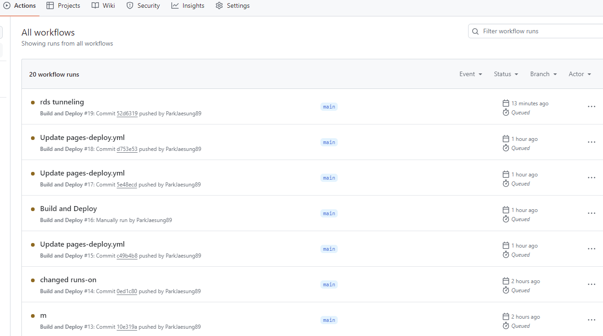
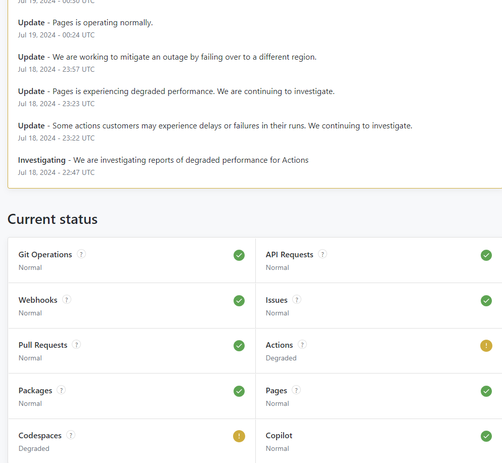

블로그 글 수정하기 위해 git push 를 사용했다. 그리고 습관적으로 github actions 탭을 확인했는데...
방금 실행된 Workflow가 Queued 상태이다. 전달까지 아무문제 없었는데 갑자기 왜 이런 상태인 걸가?  

해당 workflow를 삭제를 시도해도 삭제되지 않고 build 되어야 될 동작이 아예 시작조차 되지 않고 있다.  

[github의 상태 체크]
workflows 파일이 변경된 것도 아니라 해당 파일 문제는 아닌 것 같다고 생각되며, 구글링 해보니 ubuntu 사용시에 "runs-on" 값이 "ubuntu-latest" 로 변경해야 된다는 글들이 확인되었다.
workflow 파일 확인해보니 해당 값도 "ubuntu-latest" 이다.
좀더 찾아본 결과 Github 서비스 자체의 문제일 수 있다고 한다. github 서비스에 대한 상태를 확인 가능한 사이트를 알게 되었다. 아래 경로로 가면 github의 상태를 확인할 수 있다.

[https://www.githubstatus.com](https://www.githubstatus.com/)

해당 사이트를 통해 현재 github의 이슈가 있는지 확인해보니 아래와 같이 "actions" 와 "Codespaces"가 Degraded 상태인 것을 확인 할 수 있으며, 위에 issue들에 대해서 현 상태를 실시간으로 업데이트 하고있다.

언제 정상화 되는 걸까...?
