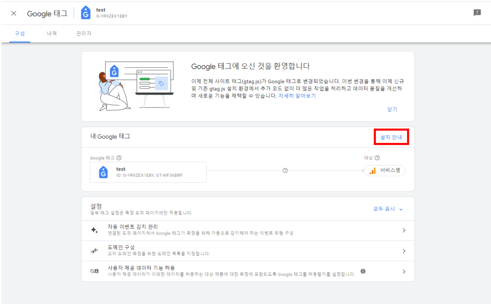

## Jekyll Blog 의 Google analytics 사용하여 블로그 조회수 적용

blog의 방문자들의 조회수 확인을 위하여 Google analytics를 사용하려고 합니다.
바로 적용해보겠습니다.

1. Google Analytics 접속을 위해 우선 google 계정 로그인합니다.
2. google analytics 접속 및 "지금 시작하세요" 클릭합니다.  
   URL : [google_analytics](https://marketingplatform.google.com/about/analytics/)
   

3. 계정을 생성합니다.

   - 계정 만들기
     

   - 계정 설정
     

   - 속성 설정
     

   - 비즈니스 정보 설정
     

   - Google analytics 서비스 승인
     

4. Datastream을 구성합니다.

   - 플랫폼 '웹' 선택
     

   - 서비스 Domain 및 네임 설정
     

   - 생성된 데이터 스트림 세부 설정 접근
     

   - 태그 설정 구성
       
       
     
     -> 해당 google tag에서 측정 ID인 'G-xxxxx'로 되있는 값을 확인합니다.

5. blog에 측정ID 값을 적용해줍니다.

   - '\_config.yaml' 파일에 google analytics 설정

   ```bash
   google_analytics:
   id: G-8WQLHTD7B2
   ```

   - '\_includes/google-analytics.html'에 위에서 확인했던 google tag의 측정 ID 값을 적용

   ```bash
    <!-- The GA snippet -->
    <!-- Global site tag (gtag.js) - Google Analytics -->
    <script defer src="https://www.googletagmanager.com/gtag/js?id=G-xxxxxxxxxxx"></script>
    <script>
    document.addEventListener('DOMContentLoaded', function (event) {
        window.dataLayer = window.dataLayer || [];
        function gtag() {
        dataLayer.push(arguments);
        }

        gtag('js', new Date());
        gtag('config', 'G-xxxxxxxxx');
    });
    </script>
   ```

6. 설정 후에 google analytics의 보고서에 그래프 수집이 잘되고 있는것을 확인할 수 있습니다.  
   
