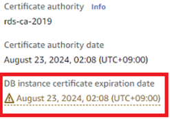
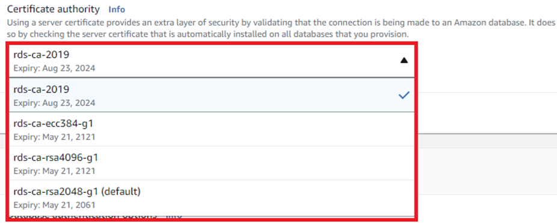
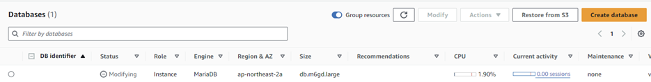
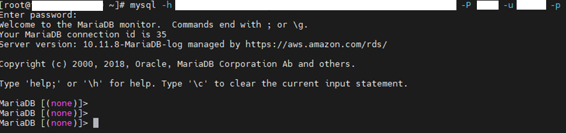
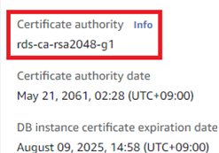

# 개요

RDS의 인증서를 "rds-ca-2019" 로 사용중이었습니다.  
만료 날짜가 얼마 남지 않아서 교체를 진행하려고 합니다.  


바로 시작 하겠습니다.

## DB 엔진버전에 대한 인증서 제공 확인

RDS 엔진 버전에 대해서 AWS에서는 CLI 명령을 통해서 확인할 수 있다고 안내하고 있습니다.  
URL = [https://aws.amazon.com/ko/blogs/korea/rotate-your-ssl-tls-certificates-now-amazon-rds-and-amazon-aurora-expire-in-2024/](https://aws.amazon.com/ko/blogs/korea/rotate-your-ssl-tls-certificates-now-amazon-rds-and-amazon-aurora-expire-in-2024/)

내용을 확인해보면 RDS 엔진에 따라서 제공하는 인증서의 종류와 교체시 재기동 여부에 대한 확인 방법에 대하여 안내하고 있습니다.  
위 내용을 참고하여 확인 해보겠습니다.
_주제에 벗어난 정보에 대해선 따로 언급하지 않습니다._

### 인증서 제공 및 재기동 여부 확인

1. AWSCLI 사용할 수 있도록 configure 설정

2. RDS의 정보 조회
   예시로 DB엔진은 mariadb-10-6-16 를 확인해 보겠습니다.

```bash
$aws rds describe-db-engine-versions --engine {DB_Engine_name}mariadb
# ex) aws rds describe-db-engine-versions --engine mariadb
.
.
.
        {
            "Engine": "mariadb",
            "EngineVersion": "10.6.16",
            "DBParameterGroupFamily": "mariadb10.6",
            "DBEngineDescription": "MariaDB Community Edition",
            "DBEngineVersionDescription": "MariaDB 10.6.16",
            "ValidUpgradeTarget": [
                {
                    "Engine": "mariadb",
                    "EngineVersion": "10.6.17",
                    "Description": "MariaDB 10.6.17",
                    "AutoUpgrade": false,
                    "IsMajorVersionUpgrade": false
                },
                {
                    "Engine": "mariadb",
                    "EngineVersion": "10.6.18",
                    "Description": "MariaDB 10.6.18",
                    "AutoUpgrade": false,
                    "IsMajorVersionUpgrade": false
                },
                {
                    "Engine": "mariadb",
                    "EngineVersion": "10.11.4",
                    "Description": "MariaDB 10.11.4",
                    "AutoUpgrade": false,
                    "IsMajorVersionUpgrade": true
                },
                {
                    "Engine": "mariadb",
                    "EngineVersion": "10.11.5",
                    "Description": "MariaDB 10.11.5",
                    "AutoUpgrade": false,
                    "IsMajorVersionUpgrade": true
                },
                {
                    "Engine": "mariadb",
                    "EngineVersion": "10.11.6",
                    "Description": "MariaDB 10.11.6",
                    "AutoUpgrade": false,
                    "IsMajorVersionUpgrade": true
                },
                {
                    "Engine": "mariadb",
                    "EngineVersion": "10.11.7",
                    "Description": "MariaDB 10.11.7",
                    "AutoUpgrade": false,
                    "IsMajorVersionUpgrade": true
                },
                {
                    "Engine": "mariadb",
                    "EngineVersion": "10.11.8",
                    "Description": "MariaDB 10.11.8",
                    "AutoUpgrade": false,
                    "IsMajorVersionUpgrade": true
                }
            ],
            "ExportableLogTypes": [
                "audit",
                "error",
                "general",
                "slowquery"
            ],
            "SupportsLogExportsToCloudwatchLogs": true,
            "SupportsReadReplica": true,
            "SupportedFeatureNames": [],
            "Status": "available",
            "SupportsParallelQuery": false,
            "SupportsGlobalDatabases": false,
            "MajorEngineVersion": "10.6",
            "SupportsBabelfish": false,
            "SupportsCertificateRotationWithoutRestart": true,
            "SupportedCACertificateIdentifiers": [
                "rds-ca-2019",
                "rds-ca-ecc384-g1",
                "rds-ca-rsa4096-g1",
                "rds-ca-rsa2048-g1"
            ]
        },
.
.
.
```

위 정보중에 아랫 부분의 "SupportsCertificateRotationWithoutRestart" 와 "SupportedCACertificateIdentifiers" 의 내용을 확인해보면 됩니다.

_SupportsCertificateRotationWithoutRestart_

- 말 그대로 인증서 교체시에 재기동하지 않는지의 여부를 나타냅니다.
- true : 재기동 하지 않음.
  fales : 재기동함.

_SupportedCACertificateIdentifiers_

- 해당 버전에서 제공하는 인증서 종류를 나타냅니다.
- mariadb-10-6-16 버전에서는 위 내용처럼 4개의 인증서 종류를 지원합니다.
  "rds-ca-2019"  
  "rds-ca-ecc384-g1"  
  "rds-ca-rsa4096-g1"  
  "rds-ca-rsa2048-g1"

### 인증서 교체

RDS > Databases > RDS 선택 > Modify  

인증서 선택 후 즉시 적용합니다.

인증서 교체 중에 rds가 재기동되지 않고 사용가능합니다.
  


인증서 교체 완료 후 변경된 것을 확인할 수 있습니다.  

